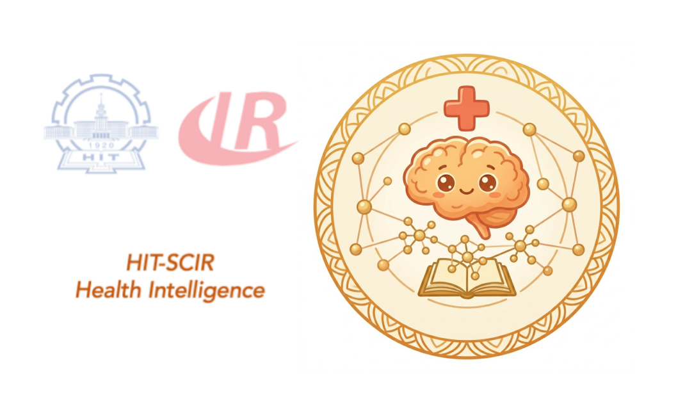
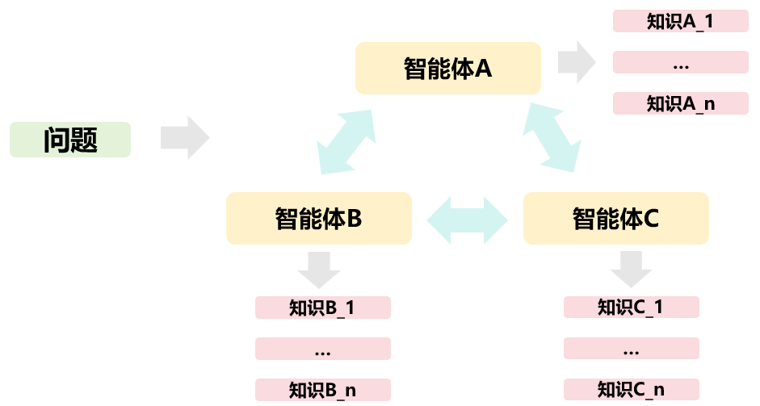

# Knowledge-Enhanced Multi-Agent Medical AI System

> 面向医学问答、复杂临床推理与多专家协作决策的知识增强多智能体 AI 诊疗系统。




本项目开源了一个 **知识增强的多智能体医学推理系统**，面向脑血管病等医学垂直领域场景，结合高质量医学知识库、领域检索模型、多专家 Agent 协作和最终决策汇总机制，用于支持医学问答、临床推理、诊疗路径分析和医学知识增强型对话系统研究。


> 免责声明：本项目主要用于科研、教学、医学问答系统原型验证与多智能体协作机制研究，不构成真实临床诊断或治疗建议。任何医疗决策均应由具备资质的临床医生结合患者实际情况做出。

---

## 核心亮点

### 1. 面向医学场景的知识增强能力

系统并非直接依赖大语言模型的参数化知识回答医学问题，而是构建了一个面向脑血管病垂直领域的高质量医学知识库，并通过检索增强生成机制为模型提供外部知识支持。

知识增强部分包括：

- **权威医学资料解析**：从指南、教材和专家共识等来源构建领域知识库。
- **LLM 辅助知识清洗**：使用大语言模型对原始文本块进行医学价值评分，过滤目录、参考文献、页眉页脚、解析错误等低价值内容。
- **语义增强与知识修补**：通过大模型润色切片内容、补全指代、省略和上下文缺失，使知识条目脱离原文后仍具备完整语义。
- **知识原子化**：将段落级知识拆解为多角度问答对，并进一步转化为独立陈述句，提升向量检索的精确度。
- **领域检索模型训练**：利用大模型表征与教师 Reranker 打分构造困难负样本，训练脑卒中领域 Reranker 用于检索知识。

最终系统可将用户问题、专家视角和原子化医学知识进行结合，为多智能体推理提供可检索、可引用、可扩展的医学知识基础。

---

### 2. 动态多智能体医学协作

系统不是固定模板式问答，而是根据医学问题动态构建专家团队。对于简单问题，系统可由基础医学分析 Agent 直接回答；对于中等或困难问题，系统会自动进入多智能体协作流程。

多智能体部分包括：

- **问题难度自动评估**：判断问题属于简单、中等或困难任务。
- **动态专家招募**：由大模型根据问题内容自动生成专家角色，例如神经内科医生、影像科医生、临床药师、感染科医生等。
- **专家层级结构生成**：自动构建专家之间的协作关系，而不是简单平铺式投票。
- **角色化问题拆解**：每个专家从自身专业视角将原始问题拆解为多个原子医学问题。
- **角色化 RAG 检索**：不同专家围绕不同子问题检索相关医学知识，减少多智能体回答同质化。
- **多轮专家讨论**：专家可以相互提问、补充、反驳和修正观点。
- **最终决策汇总**：最终决策 Agent 综合所有专家结论，生成面向用户的最终医学回答。

---

### 3. 从知识库构建到诊疗推理的完整闭环

本项目的特点不是单独实现一个 RAG 模块或一个 Agent 框架，而是将二者连接成完整系统：

```text
医学资料
  ↓
文档解析与清洗
  ↓
LLM 知识增强与原子化
  ↓
向量知识库构建
  ↓
领域 Reranker 训练
  ↓
专家角色化检索
  ↓
多智能体协作推理
  ↓
最终诊疗建议汇总
```

这一闭环使系统具备三方面优势：

1. **知识更可靠**：回答不只依赖模型记忆，而是结合外部医学知识库。
2. **推理更全面**：不同专家从不同专业角度分析同一问题。
3. **过程更可解释**：系统可展示难度判断、专家招募、知识检索、专家讨论和最终决策过程。

---

## 系统整体流程

```text
用户医学问题
    │
    ▼
问题难度评估
    │
    ├── 简单问题
    │       └── 基础医学分析 Agent 直接回答
    │
    └── 中等 / 困难问题
            │
            ▼
      动态专家招募
            │
            ▼
      专家层级结构解析
            │
            ▼
      初始化专家 Agent 团队
            │
            ▼
      各专家角色化问题拆解
            │
            ▼
      主问题 + 子问题知识检索
            │
            ▼
      并发生成专家初步意见
            │
            ▼
      医学助理阶段性总结
            │
            ▼
      多轮专家讨论与观点修正
            │
            ▼
      并发收集专家最终观点
            │
            ▼
      最终决策者综合判断
            │
            ▼
         最终医学回答
```

---

## 知识增强模块概览

### 医学知识库构建


项目支持从原始 PDF 医学资料构建向量知识库。当前流程面向脑血管病领域，使用权威指南、医学教材和专家共识作为知识来源。

知识库构建流程包括：

1. 使用文档解析工具将 PDF 转换为结构化 Markdown。
2. 使用滑动窗口方式对文档进行切片。
3. 使用 LLM 对切片进行医学价值评分，过滤低价值内容。
4. 对有效切片进行语义增强和流畅性改写。
5. 基于改写后的文本生成多角度 QA 对。
6. 将 QA 对转化为可独立理解的医学知识陈述句。
7. 为知识条目保留来源、章节、页码等元数据。
8. 使用 Embedding 模型向量化并构建 FAISS 索引。

### 检索模型训练

为提升医学领域检索效果，项目支持对 Reranker 模型进行领域微调。训练数据来自知识库构建过程中生成的问答对。

训练流程包括：

- 使用知识库 QA 构造 Query-Positive 样本。
- 使用粗召回获得候选负样本。
- 依赖更强的教师 Reranker 或大模型表征进行困难负例筛选。
- 构造 `1 个正例 + 多个困难负例` 的训练组。
- 使用 Listwise CrossEntropy 排序目标训练 Cross-Encoder Reranker。

---

## 模型与数据发布说明

本 GitHub 仓库仅发布系统源码、接口实现、文档和示意图，不直接托管模型权重、向量索引或医学数据文件。

后续计划通过 Hugging Face 单独发布以下资源：

| 资源类型 | 内容 | 发布位置 |
| --- | --- | --- |
| Reranker 权重 | 医学领域微调后的 Cross-Encoder Reranker | Hugging Face Models，待发布后补充链接 |
| Embedding / 检索配置 | 与知识库检索配套的模型配置和使用说明 | Hugging Face Models，待发布后补充链接 |
| 向量知识库 | FAISS 索引、知识条目元数据、处理后的知识片段 | Hugging Face Datasets，待发布后补充链接 |
| 训练与评测数据 | Reranker 训练样本、困难负例、评测集等 | Hugging Face Datasets，待发布后补充链接 |

由于医学资料可能涉及版权、授权和合规要求，数据集发布前会进行来源核验、脱敏检查和许可说明整理。当前阶段请将 `config.py` 中的模型路径和知识库路径配置为本地已有资源。

---

## 多智能体模块概览


### 动态专家招募


系统会根据当前问题自动生成医学专家团队，而不是预设固定专家列表。例如：

```text
问题：一名疑似急性脑卒中患者近期服用抗凝药，现在是否适合溶栓？

可能招募的专家：
1. 神经内科医生：关注卒中诊断、发病时间窗、NIHSS 评分、溶栓适应证。
2. 影像科医生：关注 CT/MRI 是否排除出血、是否存在大面积梗死。
3. 临床药师：关注抗凝药使用、凝血指标、出血风险和用药禁忌。
```

### 角色化检索


不同专家不会使用完全相同的检索查询，而是先从自身角色出发拆解问题，再围绕子问题检索医学知识。

```text
神经内科医生：
- 急性缺血性卒中的静脉溶栓时间窗是什么？
- NIHSS 评分如何影响溶栓决策？
- 哪些临床表现提示溶栓禁忌？

临床药师：
- 近期使用 DOAC 是否影响静脉溶栓？
- 抗凝药末次服药时间如何影响出血风险？
- 溶栓前应检查哪些凝血指标？
```

这样可以让不同专家获得差异化知识上下文，提高最终回答的覆盖度和专业性。

### 多轮讨论与最终决策

专家完成初步分析后，系统会组织多轮讨论。专家可以选择是否参与当前回合，并指定希望交流的对象。讨论结束后，系统并发收集各专家的最终观点，再由最终决策 Agent 汇总。

---

## 技术架构

```text
┌──────────────────────────────────────────┐
│              FastAPI Server              │
│       普通问答接口 / SSE 流式接口          │
└──────────────────┬───────────────────────┘
                   │
                   ▼
┌──────────────────────────────────────────┐
│             Agent Orchestrator            │
│   难度评估 / 专家招募 / 讨论调度 / 决策汇总 │
└──────────────────┬───────────────────────┘
                   │
       ┌───────────┴───────────┐
       ▼                       ▼
┌───────────────┐       ┌──────────────────┐
│ Medical Agents│       │  Retrieval Engine │
│ 专家角色推理   │       │  FAISS + Reranker │
└───────────────┘       └──────────────────┘
       │                       │
       └───────────┬───────────┘
                   ▼
┌──────────────────────────────────────────┐
│        Knowledge-Enhanced Reasoning       │
│       角色化知识检索 + 多专家综合推理       │
└──────────────────────────────────────────┘
```

---

## 主要模块

```text
.
├── config.py          # 全局配置：模型、服务、检索、生成参数、CORS 与会话参数
├── utils.py           # Agent 封装、LLM 调用、流式输出、难度评估
├── retriever.py       # 医学知识检索、子问题分解、子问题润色、重排
├── md_agent.py        # 动态专家招募、多专家讨论、最终决策汇总
├── multi_agent.py     # FastAPI 服务入口、普通接口、流式接口、会话管理
├── one_agent.py       # 简单问题处理逻辑
├── med_agent.py       # 中等复杂度问题处理逻辑
├── test.py            # 本地测试脚本
└── medrag_pipeline/   # 知识库构建与检索模型训练流程
```

---

## 快速开始

### 1. 创建环境

```bash
conda create -n medical-agent python=3.10
conda activate medical-agent
```

### 2. 安装依赖

```bash
pip install fastapi uvicorn openai
pip install torch transformers
pip install langchain langchain-community
pip install faiss-cpu
pip install pydantic tqdm termcolor prettytable pptree regex
```

如需使用 GPU 版 FAISS，可根据 CUDA 环境安装对应版本。

### 3. 启动本地大模型服务

项目使用 OpenAI-compatible API，可通过 vLLM 启动本地模型服务：

```bash
vllm serve /path/to/Qwen3-32B-AWQ \
  --host 0.0.0.0 \
  --port 8000 \
  --served-model-name Qwen3-32B-AWQ
```

### 4. 修改集中配置

项目所有可调整配置集中在 `config.py`。若使用后续发布在 Hugging Face 的 Reranker 权重、向量知识库或训练数据，请先下载到本地，再将路径填入配置文件：

```python
# OpenAI-compatible LLM service.
SERVE_URL = "http://localhost:8000/v1"
OPENAI_API_KEY = "not-needed"
MODEL_NAME = "Qwen3-32B-AWQ"

# Local retrieval resources.
EMBEDDING_MODEL = "/path/to/bge-m3"
RERANK_MODEL = "/path/to/bge-reranker-base"
FAISS_INDEX_PATH = "/path/to/faiss_index_A"

# Retrieval defaults.
DEFAULT_FAISS_VERSION = "v4"
RETRIEVER_MAIN_TOPK = 3
RETRIEVER_SUB_TOPK = 3
RETRIEVER_MIN_SCORE = 0.9
STREAM_RETRIEVER_MIN_SCORE = 0.95
RERANK_TOP_N = 10
VECTOR_RETRIEVER_TOP_K = 50

# FastAPI service.
SERVER_HOST = "0.0.0.0"
SERVER_PORT = 50042

# Generation defaults.
GENERATION_CONFIG_BASE = {
    "model": MODEL_NAME,
    "temperature": 0.7,
    "top_p": 0.8,
    "max_tokens": 16384,
    "frequency_penalty": 0.05,
    "stop": None,
    "stream": True,
}
```

`utils.py`、`retriever.py`、`multi_agent.py`、`md_agent.py`、`one_agent.py` 和 `test.py` 均从 `config.py` 读取配置，不再在业务代码中维护模型路径、服务地址、检索阈值或生成参数。其中 `RERANK_MODEL` 和 `FAISS_INDEX_PATH` 对应的权重与索引文件后续将通过 Hugging Face 发布，GitHub 仓库不包含这些大文件。

### 5. 启动后端服务

```bash
python multi_agent.py
```

默认服务地址：

```text
http://0.0.0.0:50042
```

---

## API 示例

### 普通问答接口

```bash
curl -X POST "http://localhost:50042/chat" \
  -H "Content-Type: application/json" \
  -d '{
    "query": "较为常见视幻觉的痴呆类型是？A:帕金森痴呆，B:血管性痴呆，C:路易体痴呆，D:额颞叶痴呆，E:Alzheimer病",
    "id": "demo-session"
  }'
```

### 流式多智能体接口

```bash
curl -N -X POST "http://localhost:50042/chat/stream" \
  -H "Content-Type: application/json" \
  -d '{
    "query": "一名疑似急性脑卒中患者近期服用抗凝药，现在是否适合溶栓？请综合分析。",
    "id": "demo-session",
    "enableMultiAgent": true,
    "difficulty": "hard"
  }'
```

流式接口会返回难度评估、专家招募、专家输出、讨论过程和最终答案等事件，便于前端实时展示系统推理过程。

---

## 适用场景

- 医学问答系统原型研究
- 医学 RAG 系统构建
- 多智能体协作推理研究
- 临床决策支持系统探索
- 医学知识库构建与检索模型训练
- 医学教育、病例讨论和专家协作模拟

---

## 项目定位

本项目关注的是 **知识增强多智能体医学推理机制**，重点探索：

- 如何构建适合医学推理的高质量知识库；
- 如何训练更适合医学领域的检索模型；
- 如何让不同医学专家 Agent 基于角色化知识进行差异化推理；
- 如何通过多轮讨论提升复杂医学问题回答的全面性与稳定性。

---

## License

本项目建议采用 MIT License 开源。若知识库涉及受版权保护的教材、指南或专家共识，请在发布前确认数据来源、授权范围和分发方式。

---
## Contributor

本项目由哈尔滨工业大学SCIR实验室健康智能组杜晏睿、李家运、李文豪、马铭、赵丹杨、高一博完成，指导教师为赵森栋副教授，王昊淳副研究员以及秦兵教授。


---

## Citation

如果本项目对你的研究或开发有帮助，欢迎引用或 Star 本仓库。

```bibtex
@misc{knowledge_enhanced_multiagent_medical_ai,
  title        = {Knowledge-Enhanced Multi-Agent Medical AI System},
  year         = {2026},
  howpublished = {Open-source project}
}
```
