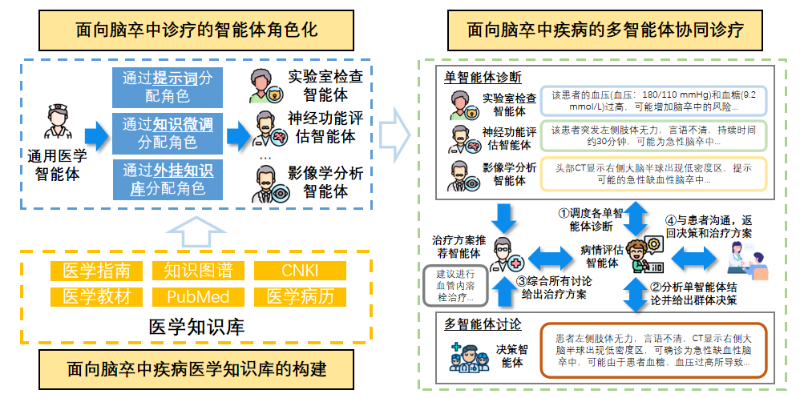
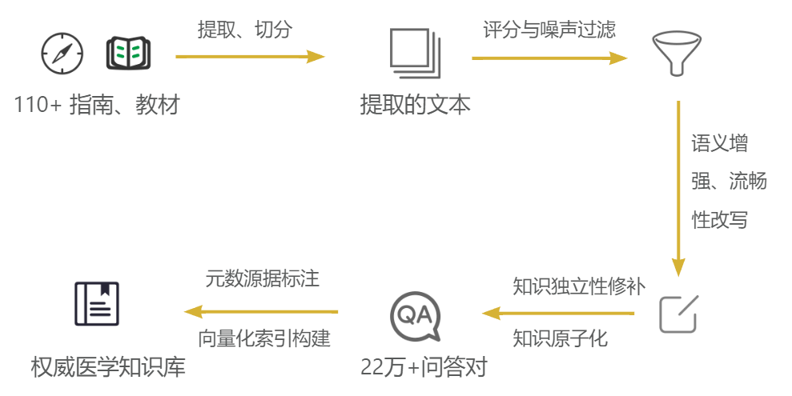
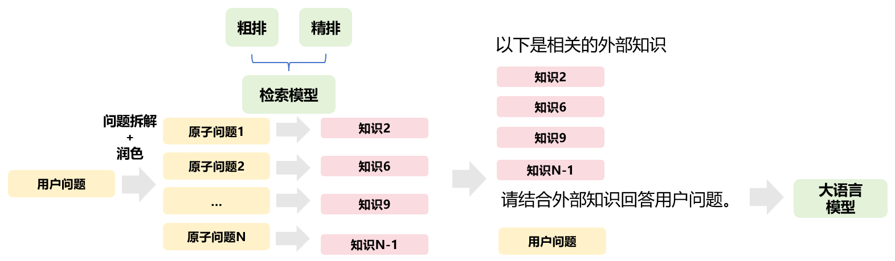
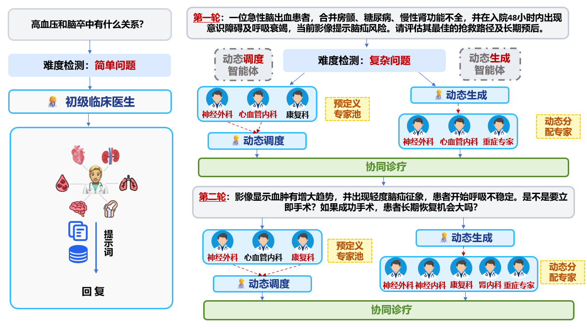

# 知识增强多智能体 AI 诊疗系统：详细技术说明文档

本文档详细说明知识增强多智能体 AI 诊疗系统的整体架构、知识库构建流程、检索模型训练方法、多智能体协作机制和服务接口实现。

---

## 1. 系统目标

本系统面向医学问答、复杂临床推理和多专家协作诊疗场景，目标是构建一个可解释、可扩展、可检索增强的多智能体医学推理框架。

系统设计围绕两个核心问题展开：

1. **医学知识如何可靠进入大模型推理过程？**  
   通用大语言模型在医学垂直领域容易受到参数知识不足、幻觉、知识过时和缺少来源约束等问题影响。因此系统首先构建高质量医学知识库，并训练领域检索模型，使模型在回答前能够获得相关外部知识。

2. **复杂医学问题如何由多个专业视角共同分析？**  
   临床问题往往涉及诊断、影像、用药、风险、病因、治疗路径和个体化因素。单一模型回答容易角度单一。因此系统引入动态多智能体机制，由大模型按问题内容分配专家角色，每个专家基于自身专业视角拆解问题、检索知识、形成意见，并通过讨论和汇总生成最终答案。

---

## 2. 总体架构


系统由两大子系统构成：

1. **知识增强子系统**
   - 医学资料解析
   - 文本切片与质量过滤
   - LLM 知识润色与知识原子化
   - 向量知识库构建
   - 检索模型训练与重排

2. **多智能体诊疗子系统**
   - 医学问题难度评估
   - 动态专家招募
   - 专家层级结构解析
   - 专家角色化问题拆解
   - 角色化 RAG 检索
   - 专家初步意见生成
   - 多轮专家讨论
   - 专家最终观点收集
   - 最终决策汇总

整体流程如下：

```text
原始医学资料
    │
    ▼
PDF 解析与 Markdown 转换
    │
    ▼
滑动窗口切片
    │
    ▼
LLM 医学价值评分与过滤
    │
    ▼
LLM 语义增强与知识原子化
    │
    ▼
医学知识条目 + 元数据
    │
    ▼
Embedding 向量化 + FAISS 索引
    │
    ▼
Reranker 领域微调
    │
    ▼
知识增强检索引擎
    │
    ▼
多智能体医学推理系统
```

---

## 3. 知识增强子系统



### 3.1 数据来源

知识库构建面向脑血管病等医学垂直领域，原始资料主要来自：

- 国家卫健委或专业学会发布的诊疗指南；
- 高等医学院校教材，如神经病学、内科学等；
- 权威专家共识和临床规范文件。

当前流程可处理 110 份以上权威医学资料，并支持扩展到其他专科领域，如心血管、呼吸、感染、肿瘤、儿科等。

---

### 3.2 文档解析

#### 目标

将 PDF 医学资料转换为结构化 Markdown 文本，同时尽量保留标题层级、段落结构、表格和章节信息。

#### 实现方式

使用 MinerU 等智能文档解析工具处理 PDF，相比传统 OCR，其优势在于：

- 能处理医学资料中常见的双栏排版；
- 能保留标题层级和章节结构；
- 能解析表格、列表和段落；
- 能减少页眉、页脚、编号等噪声对后续处理的影响。

#### 输出

每份 PDF 被转换为对应的 Markdown 文档，并保留来源文件名、章节标题、页码等元信息。

---

### 3.3 滑动窗口切片

#### 目标

将长文档拆分为适合 LLM 处理和向量检索的文本块，同时减少切分边界造成的语义丢失。

#### 推荐配置

| 参数 | 推荐值 |
|---|---:|
| 切片大小 | 1024 tokens |
| 重叠长度 | 300 tokens |
| 原始切片规模 | 约 28,382 个文本块 |

#### 设计原因

- 医学知识常跨越多个句子或表格说明，过短切片会破坏语义完整性；
- 过长切片会引入多个知识点，降低向量匹配精度；
- 适当重叠可以避免关键结论刚好位于切分边界时丢失上下文。

---

### 3.4 基于 LLM 的质量评分与过滤

#### 问题

原始切片中包含大量低价值内容，例如：

- 目录；
- 参考文献；
- 页眉页脚；
- PDF 解析错误；
- 泛泛背景介绍；
- 缺少具体医学结论的说明性文字。

如果这些内容直接进入向量库，会增加索引压力，并在检索时产生误召回。

#### 评分策略

系统使用大语言模型对每个 Chunk 进行 0-5 分医学价值评分：

| 分数 | 含义 | 处理方式 |
|---:|---|---|
| 0 | 系统解析错误 | 剔除 |
| 1 | 无实质医学内容，如目录、参考文献、页眉页脚 | 剔除 |
| 2 | 泛泛背景介绍，缺少具体诊疗价值 | 剔除 |
| 3 | 含流程、量表、风险评估，但缺少明确推荐 | 保留 |
| 4 | 含关键医学结论，但上下文略缺 | 保留 |
| 5 | 完整临床指南片段，包含适应证、剂量、证据等级等 | 保留 |

#### 清洗结果示例

| 分数段 | 判定 | Chunk 数量 | 占比 | 处理决策 |
|---|---|---:|---:|---|
| 0-2 分 | 噪声数据 | 6,304 | 22.22% | 剔除 |
| 3-5 分 | 有效知识 | 22,078 | 77.78% | 保留 |

该步骤可以显著提升知识库信噪比，减少后续检索中的无效召回。

---

### 3.5 语义增强与流畅性改写

#### 问题

滑动窗口切片后，文本块可能存在以下问题：

- 开头或结尾被截断；
- 出现“该药物”“上述症状”“此类患者”等指代不明表达；
- 表格或列表转 Markdown 后缺少自然语言连接；
- 单独阅读时缺少主语或疾病对象。

#### 实现方式

对保留的高质量 Chunk 使用 LLM 进行语义增强和流畅性改写。Prompt 需要强调三类约束：

1. **忠实性约束**：不得新增原文没有的医学结论。
2. **医学准确性约束**：剂量、单位、时间窗、评分阈值、证据等级等必须保持不变。
3. **完整性约束**：将代词、上下文依赖表达补全为明确医学实体。

#### 输入输出示例

```text
输入：
该药物应在发病 4.5 小时内使用，存在出血风险者禁用。

输出：
阿替普酶静脉溶栓应在急性缺血性脑卒中发病 4.5 小时内使用，存在活动性出血或高出血风险的患者应禁用。
```

---

### 3.6 知识原子化：问答对生成

#### 问题

段落级 Chunk 往往包含多个知识点，例如适应证、禁忌证、剂量、检查指标和预后因素。如果直接向量化，多个语义会相互稀释，导致细粒度问题难以精确匹配。

#### 实现方式

使用 LLM 从每个高质量 Chunk 中生成多角度问答对。问题类型包括：

- 事实类问题；
- 原因类问题；
- 是非判断类问题；
- 列举类问题；
- 条件约束类问题；
- 临床路径类问题。

#### 约束

- Answer 必须严格来自原文；
- 不允许引入外部医学知识；
- 问题应尽量具体，包含疾病、人群、干预、时间窗或条件限定；
- 输出使用 JSON，方便自动解析和后续训练。

---

### 3.7 知识修补：独立陈述句转化

#### 问题

QA 对中的答案常依赖问题才能理解。例如：

```text
Q: 急性肾功能障碍的临床表现有哪些？
A: 表现为少尿或无尿、代谢性酸中毒、高血钾、氮质血症和水肿。
```

如果只将 Answer 向量化，句子缺少主语，检索效果会下降。

#### 实现方式

系统将 Question 与 Answer 合并，并使用 LLM 转换为独立陈述句：

```text
急性肾功能障碍的临床表现包括少尿或无尿、代谢性酸中毒、高血钾、氮质血症和水肿。
```

#### 作用

- 保证每条知识都可以独立理解；
- 提升向量表征的语义完整性；
- 减少检索时 Query 与 Passage 的语义错配；
- 便于后续作为 RAG 上下文直接注入模型。

当前流程可生成 22 万条以上独立医学知识条目。

---

### 3.8 元数据标注与向量化

每条知识条目应包含以下字段：

```json
{
  "id": "unique_id",
  "text": "独立医学知识陈述句",
  "source": "指南或教材名称",
  "chapter": "章节名称",
  "page": "页码",
  "raw_chunk_id": "来源文本块 ID",
  "qa_pair": {
    "question": "生成的问题",
    "answer": "原始答案"
  }
}
```

向量化流程：

1. 使用 Embedding 模型将知识条目转为向量；
2. 使用 FAISS 构建本地向量索引；
3. 保存索引文件与元数据映射；
4. 检索时返回知识文本、来源、章节和页码。

推荐配置：

```python
EMBEDDING_MODEL = "/path/to/bge-m3"
FAISS_INDEX_PATH = "/path/to/faiss_index_A"
```

---

## 4. 检索模型训练

### 4.1 训练目标

通用检索模型在医学领域可能无法准确区分细粒度临床语义，例如：

- 适应证和禁忌证差异；
- 药物剂量差异；
- 时间窗差异；
- 成人与儿童患者差异；
- 缺血性卒中与出血性卒中的治疗差异。

因此系统对 Reranker 进行领域微调，使其能够更准确地判断 Query 与医学知识条目的相关性。

---

### 4.2 基座模型

| 模型 | 架构 | 作用 |
|---|---|---|
| BGE-M3 | Bi-Encoder | 向量召回 |
| BGE Reranker Base | Cross-Encoder | 候选文档重排 |
| Qwen3-Reranker-8B 或更强教师模型 | Cross-Encoder / LLM Reranker | 困难负例筛选与蒸馏 |

---

### 4.3 训练样本构造

每个训练样本由一个 Query、一个正例和多个困难负例组成：

```text
Group = [Positive × 1] + [Hard Negative × 10]
Group Size = 11
```

其中：

- Query 来自知识库生成的医学问题；
- Positive 是对应的 gold knowledge；
- Hard Negatives 来自粗召回候选，再由教师模型筛选。

---

### 4.4 困难负例挖掘

#### Step 1：粗召回

使用现有向量检索模型对每个 Query 召回 Top-K 候选文档，例如 Top-320。

#### Step 2：教师模型打分

使用更强的教师 Reranker 对 Query-Candidate 进行相关性评分。可使用如下形式：

```text
Score = logits("yes") - logits("no")
```

#### Step 3：边界样本筛选

选择 Score 位于 `[-1, 1]` 区间的候选作为困难负例池。该区间样本通常具有以下特点：

- 与 Query 语义高度相关；
- 但在疾病、人群、时间、剂量、检查指标或诊疗结论上存在差异；
- 比随机负例更能提供有效训练信号。

#### Step 4：训练组采样

从困难负例池中随机采样 10 个负例，与 1 个正例组成训练组。

---

### 4.5 训练目标函数

Reranker 采用 Listwise 排序训练。给定一个包含 1 个正例和 N 个负例的训练组：

```text
G = {p+, p1-, p2-, ..., pN-}
```

模型分别输出相关性得分：

```text
{s+, s1-, s2-, ..., sN-}
```

使用 CrossEntropy 让正例在整个 Group 中获得最高得分：

```text
L = -log( exp(s+) / (exp(s+) + Σ exp(si-)) )
```

该目标迫使模型在多个高干扰医学负例中识别真正相关的知识条目。

---

### 4.6 推荐训练配置

| 配置项 | 推荐值 |
|---|---|
| 训练框架 | FlagEmbedding Reranker Finetune Pipeline |
| 模型结构 | Encoder-only Cross-Encoder / Sequence Classification |
| 基座模型 | BAAI/bge-reranker-base |
| Group Size | 11 |
| 正负例比例 | 1 positive + 10 hard negatives |
| 训练策略 | Listwise 对比排序 |
| 精度 | bf16 |
| 学习率 | 6e-5 |
| 梯度累积 | 32 |

---

## 5. 检索引擎实现


### 5.1 普通检索流程

```text
用户问题
   │
   ▼
Embedding 向量化
   │
   ▼
FAISS Top-K 召回
   │
   ▼
Reranker 重排
   │
   ▼
过滤低相关文档
   │
   ▼
返回 top-k 医学知识
```

### 5.2 多通道检索流程

复杂问题不仅使用原始问题检索，还会进行子问题分解：

```text
原始问题
   │
   ├── 主问题直接检索
   │       └── main_docs
   │
   └── 子问题分解
           │
           ├── 子问题 1 → 检索
           ├── 子问题 2 → 检索
           └── 子问题 n → 检索
                    └── sub_docs
```

### 5.3 角色化检索流程

多智能体模式下，检索模块接收专家角色 `need_dim`，让不同专家从自身专业角度拆解问题。

```python
retrieve_docs_multi_channel(
    question=question,
    model=model,
    is_polish=True,
    need_dim="神经内科医生"
)
```

角色化检索的核心价值是让专家获得差异化知识上下文。例如同一脑卒中问题：

- 神经内科医生关注发病时间窗、NIHSS、溶栓适应证；
- 影像科医生关注出血排除、梗死范围、影像征象；
- 临床药师关注抗凝药、凝血指标、药物相互作用和出血风险。

---

## 6. 多智能体诊疗子系统


### 6.1 问题难度评估

系统首先调用医学初步评估 Agent，对用户问题进行难度分类。

输出格式：

```json
{
  "理由": "判断依据",
  "决策": "简单 / 中等 / 困难"
}
```

处理路径：

| 难度 | 问题类型 | 处理方式 |
|---|---|---|
| 简单 | 医学术语解释、事实性问答、常见症状识别 | 基础医学分析 Agent |
| 中等 | 多因素对比、辅助诊断、风险解释、简单临床路径 | 中等复杂度 Agent 或轻量多智能体 |
| 困难 | 个体化诊疗、不典型病例、多源知识整合、多学科推理 | 动态专家团队 + RAG + 多轮讨论 |

---

### 6.2 动态专家招募

对于复杂问题，系统创建“招募者” Agent，由其根据问题内容生成专家团队。

招募结果示例：

```text
1. 神经内科医生 - 专注于卒中诊断、神经功能评估和溶栓适应证判断。 - 层级结构：独立
2. 影像科医生 - 专注于头颅 CT/MRI 解读、出血排除和梗死范围评估。 - 层级结构：神经内科医生 > 影像科医生
3. 临床药师 - 专注于抗凝药、溶栓药物禁忌证、药物相互作用和出血风险。 - 层级结构：独立
```

系统优势：

- 不依赖固定专家模板；
- 可根据不同问题自动选择专家；
- 支持不同专科问题扩展；
- 专家组合更贴近真实临床多学科会诊。

---

### 6.3 专家层级结构解析

系统会解析招募者输出中的层级结构。例如：

```text
神经内科医生 > 影像科医生
```

表示影像科医生作为神经内科医生的协作对象加入团队。系统内部可构建如下结构：

```text
moderator
├── 神经内科医生
│   └── 影像科医生
└── 临床药师
```

如果专家标记为“独立”，则直接挂载到 moderator 节点下。

---

### 6.4 Agent 统一封装

所有专家均基于统一 `Agent` 类实现。

核心字段：

```python
class Agent:
    def __init__(self, client, role_message, role, examplers=None):
        self.client = client
        self.role_message = role_message
        self.role = role
        self.messages = []
        self.examplers = examplers
```

核心能力：

- 维护独立 system prompt；
- 保存每个 Agent 的对话历史；
- 调用 OpenAI-compatible LLM API；
- 支持普通输出和流式输出；
- 支持 callback 将生成过程传递给 SSE 接口。

不同角色可使用不同生成策略：

- 难度评估 Agent 和招募者 Agent 使用更确定性的输出；
- 医学专家 Agent 使用流式输出，便于前端展示过程；
- 最终决策 Agent 综合所有专家观点生成最终答案。

---

### 6.5 专家初步意见生成

每个专家的初步分析流程如下：

```text
专家角色
   │
   ▼
基于角色拆解原始问题
   │
   ▼
检索主问题和角色化子问题相关知识
   │
   ▼
将检索知识拼接到专家输入上下文
   │
   ▼
生成该专家的专业初步意见
```

系统采用并发方式生成多个专家初步意见，以减少串行调用带来的延迟。

---

### 6.6 医学助理阶段性总结

在多轮讨论之前，系统创建“医学助理” Agent，对各专家初步意见进行阶段性总结。

总结内容包括：

1. 不同专家的一致意见；
2. 不同专家的分歧点；
3. 需要进一步讨论的问题；
4. 当前已检索到的关键医学知识；
5. 对下一轮讨论的上下文组织。

推荐输出格式：

```text
关键知识：...
总体分析：...
待讨论问题：...
```

---

### 6.7 多轮专家讨论机制

系统默认执行多轮讨论，每轮可包含多个专家交互回合。

每个回合包括三步：

#### Step 1：参与意愿判断

专家先判断是否需要参与当前回合：

```text
Yes：需要和其他专家交流、提问、补充或反驳。
No：当前观点已经足够确定，不参与本回合讨论。
```

#### Step 2：选择交流对象

如果专家选择参与，则需要选择目标专家：

```text
代理 1：神经内科医生
代理 2：影像科医生
代理 3：临床药师
```

#### Step 3：生成交互内容

专家向目标专家提出问题、补充或反驳。例如：

```text
神经内科医生 -> 临床药师：
该患者近期使用抗凝药会直接影响溶栓禁忌证判断，请进一步评估末次服药时间和凝血指标。

临床药师 -> 神经内科医生：
如果患者 48 小时内使用 DOAC，应结合凝血指标和肾功能判断药物残留及出血风险。
```

所有交互都会被记录，并作为后续专家最终观点生成的上下文。

---

### 6.8 专家最终观点收集

讨论结束后，系统并发收集所有专家的最终观点。每个专家需要综合：

- 自身初步分析；
- 检索到的医学知识；
- 医学助理阶段性总结；
- 其他专家评论；
- 多轮讨论中的补充与反驳。

专家最终观点应尽量包含：

```text
1. 本专家视角下的核心判断；
2. 支持该判断的关键依据；
3. 仍需补充的信息或检查；
4. 对最终诊疗建议的贡献。
```

---

### 6.9 最终决策汇总

最终决策 Agent 会读取所有专家最终观点，并形成面向用户的最终回答。

输入包括：

```text
原始医学问题
各专家最终观点
多轮讨论记录
检索到的关键医学知识
```

输出格式建议：

```text
答案：...
依据：...
风险与注意事项：...
建议进一步确认的信息：...
```

对于选择题或评测任务，可要求输出：

```text
\boxed{C}
```

---

## 7. 服务接口实现

### 7.1 后端模块

```text
multi_agent.py
├── FastAPI 应用初始化
├── CORS 配置
├── OpenAI-compatible client 初始化
├── 会话历史 conversation_history 管理
├── 普通问答接口 /chat
├── 流式问答接口 /chat/stream
└── SSE 消息队列管理
```

### 7.2 普通接口 `/chat`

处理流程：

```text
POST /chat
   │
   ▼
读取 query 和 session_id
   │
   ▼
拼接历史对话上下文
   │
   ▼
判断问题难度
   │
   ├── 简单：process_base_query
   ├── 中等：process_mid_query
   └── 困难：process_diff_query
   │
   ▼
保存会话历史
   │
   ▼
返回最终结果 JSON
```

### 7.3 流式接口 `/chat/stream`

系统使用 Server-Sent Events 返回推理过程。

流式消息类型：

| 类型 | 含义 |
|---|---|
| `agent_step` | 某个智能体或系统阶段正在执行 |
| `agent_output` | 某个智能体输出完整内容 |
| `incremental` | 智能体流式生成增量 token |
| `final_result` | 最终回答 |
| `complete` | 当前请求处理完成 |
| `error` | 执行过程中出现错误 |

流式流程：

```text
POST /chat/stream
   │
   ▼
创建 session 对应消息队列
   │
   ▼
启动后台线程执行 background_process
   │
   ▼
后台线程写入 agent_step / agent_output / final_result
   │
   ▼
stream_generator 从队列读取消息并通过 SSE 返回
   │
   ▼
complete 消息结束输出
```

---

## 8. 会话历史管理

服务端维护 `conversation_history`，根据 `session_id` 保存最近若干轮用户问题和系统回答。

新一轮问答时，系统可将历史上下文拼接到当前问题前：

```text
以下是之前的对话历史：
用户问题：...
助手回答：...

请基于以上对话历史回答当前问题。

当前问题：...
```

该机制支持连续医学咨询和上下文相关追问。

---

## 9. 关键实现建议

### 9.1 Prompt 设计建议

#### 知识库构建 Prompt

需要强调：

- 不得新增医学事实；
- 保留剂量、单位、时间窗、证据等级；
- 将指代词补全为具体实体；
- 输出严格 JSON，便于程序解析。

#### 专家 Agent Prompt

需要强调：

- 只能以当前专家角色进行分析；
- 优先使用检索到的医学知识；
- 明确指出不确定性；
- 避免给出越权或确定性临床诊断；
- 对高风险问题加入就医和医生确认提示。

#### 最终决策 Prompt

需要强调：

- 综合多个专家观点；
- 明确一致意见与分歧点；
- 不机械多数投票，允许基于证据质量加权；
- 对缺失信息给出进一步检查建议；
- 保持医学安全边界。

---

### 9.2 检索安全建议

医学 RAG 系统需要避免“检索到就使用”的错误。建议加入：

- Reranker 分数阈值；
- 低相关知识过滤；
- 多来源交叉验证；
- 知识来源展示；
- 对冲突知识进行显式标注；
- 对过时指南或旧版本资料进行版本管理。

---

### 9.3 多智能体安全建议

多智能体并不天然保证正确性。建议加入：

- 专家观点一致性检查；
- 高风险结论二次确认；
- 最终回答中的不确定性表达；
- 禁止替代医生诊断；
- 对急症场景提示立即就医；
- 对药物剂量、禁忌证、用药方案增加保守约束。

---

## 10. 推荐项目目录

```text
Knowledge-Enhanced-MultiAgent-Medical-AI/
├── README.md
├── docs/
│   ├── technical_design.md
│   ├── knowledge_base_pipeline.md
│   ├── reranker_training.md
│   └── multi_agent_reasoning.md
├── configs/
│   └── config.py
├── medical_agent/
│   ├── utils.py
│   ├── retriever.py
│   ├── md_agent.py
│   ├── multi_agent.py
│   ├── one_agent.py
│   └── med_agent.py
├── medrag_pipeline/
│   ├── parsing/
│   │   ├── magic_pdf_server.py
│   │   └── remote_parser.py
│   ├── knowledge/
│   │   ├── filter_chunks.py
│   │   ├── question_generation.py
│   │   ├── question_rewrite.py
│   │   ├── knowledge_repair.py
│   │   └── knowledge_base.py
│   └── finetune/
│       ├── build_dataset.py
│       ├── rerank_dataset_builder.py
│       ├── rerank_dataset_builder_llm.py
│       ├── data_filter.py
│       ├── margin_train.py
│       └── evaluation.py
├── examples/
│   ├── simple_qa.json
│   ├── stroke_case.json
│   └── stream_demo.md
├── scripts/
│   ├── build_faiss_index.py
│   ├── train_reranker.sh
│   └── launch_server.sh
├── data/
│   └── README.md
└── outputs/
```

---

## 11. 可扩展方向

### 11.1 知识库扩展

- 从脑血管病扩展到心血管、肿瘤、感染、呼吸、儿科等专科；
- 引入指南版本管理；
- 支持多语言医学知识库；
- 增加知识冲突检测和来源可信度评分。

### 11.2 检索模型增强

- 训练领域 Embedding 模型；
- 引入多教师 Reranker 蒸馏；
- 增加 hard negative 去噪；
- 使用临床语义相似度评测集进行评估；
- 针对药物剂量、时间窗、禁忌证设计专项检索评测。

### 11.3 多智能体增强

- 支持更多专家数量和动态轮数；
- 引入专家置信度估计；
- 加入专家观点冲突检测；
- 将讨论图结构可视化；
- 支持人工医生介入审核；
- 支持病例结构化输入，如主诉、现病史、检查、检验和用药史。

---

## 12. 总结

本系统实现了从医学知识库构建、领域检索模型训练到多智能体诊疗推理的完整链路。其核心思想是：

1. 使用 LLM 辅助构建高质量、原子化、可检索的医学知识库；
2. 使用大模型表征和教师 Reranker 构造困难负样本，训练更适合医学领域的重排模型；
3. 使用动态多智能体机制，将复杂医学问题分配给不同专家；
4. 让每个专家基于自身角色拆解问题并检索相关知识；
5. 通过多轮讨论和最终决策汇总，提高回答的全面性、可解释性和稳定性。

该系统适合用于医学 RAG、多智能体临床推理、医学问答系统、病例讨论模拟和医疗 AI 研究原型开发。
